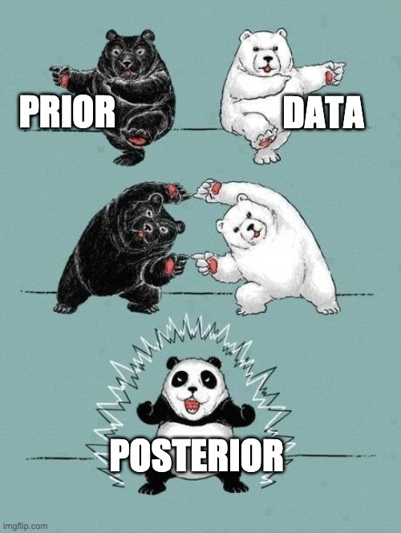
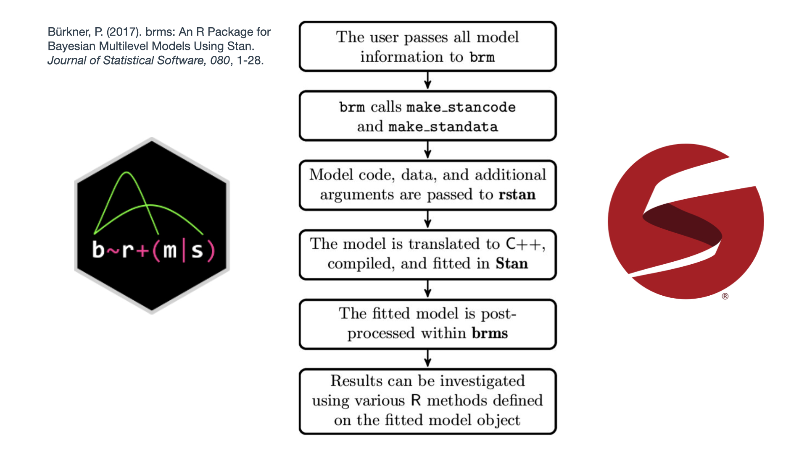

# Introduction

```{css echo=FALSE}
.small-code{
  font-size: 75%
}
```

```{r}
#| echo: false
#| include: false
#| message: false
#| warning: false

# Packages are loaded here as well as on the "Frequentistic ..." slide.
# That slide shows the library() calls on purpose, but the elicitation
# slides now come BEFORE it and already need tidyverse/ggplot2.
library(here)
library(tidyverse)
library(brms)
library(bayesplot)

# ── THE ROOM ────────────────────────────────────────────────────────
# Everything the room supplies - their two elicited ranges and their own
# commuting times - is read from Data/room_2026.csv by this one file.
# To use a different room, replace that CSV and re-render. Nothing in
# this deck has a participant number typed into it.
#
# Defines: COVERAGE, Z, ind_low/ind_high, sigma_prior, sigma_logsd,
#          mu_low/mu_high, mu_prior, sd_prior, sd_between, sd_within,
#          CT, ct_mean, ct_sd, C1_mu, C1_sigma, C2_mu, C2_sigma,
#          GRID_MU, GRID_SIGMA, SIGMA_VIEW, N_ROOM, N_EARLY,
#          ROOM_IS_REAL, ROOM_NOTE, ROOM_VERDICT

source(here("R_code", "elicitation.R"))
```

## Welcome

Let's get to know each other first!

- what's your name?
- a 1/2-minute pitch on your research
- any experience with Bayesian inference?
- what do you hope to learn?

## Outline

Part 1: Introduction to Bayesian inferences and some basics in `brms`

Part 2: Checking the model with the WAMBS and how to do it in `R`

Part 3: Reporting and interpreting Bayesian models

Part 4: Analysing your own data or integrated exercise

Throughout the different presentations we will also increase model complexity

## Practical stuff

All material is on the on-line dashboard:

<https://bar-edubron2026.netlify.app/>

You can find:

- an overview of the course

- how to prepare

- for each day the slides and datasets

- html slides can be exported to pdf in your browser (use the menu button bottom right)

# Statistical Inference

## Why statistical inference?

::: center-xy
We want to learn more about [a population]{.hl} but we have [sample data]{.hl}!

Therefore, we have [uncertainty]{.hl}
:::


## Why statistical inference? an example

> What is the effect of how far you live from work on the time your commute takes?

We can estimate the effect by using a regression model based on sample data:

$$\text{CommuteTime}_i = \beta_0 + \beta_1 * \text{Distance}_i + \epsilon_i$$

Of course, we are not interested in the value of $\beta_1$ in the sample, but we want to learn more on $\beta_1$ in the population!

## Frequentistic statistical inference (with data...)

Maximum Likelihood estimation:

::: small-code
```{r}
## Libraries

library(here)
library(tidyverse)
library(brms)
library(bayesplot)

## Load the data

CommuteData <- read_csv(
  file = here("Presentations", "CommuteData.csv")
)

CommuteData <- CommuteData |>
  mutate(
    Distance_c  = Distance - mean(Distance, na.rm = T),
    Departure_c = DepartureHour - 7          # hours after 07:00
  )

Model1 <- lm(CommuteTime ~ Distance_c, data = CommuteData)

summary(Model1)
```
:::

::: aside
Simulated data: `simulate_commute.R` documents the process and its sources.
:::

## Frequentistic statistical inference (interpretation ...)

```{r}
#| echo: false
# taken from Model1 above, so the text can never drift from the output
b1_hat <- coef(Model1)[["Distance_c"]]
se1    <- summary(Model1)$coefficients["Distance_c", "Std. Error"]
lower  <- b1_hat - (1.96 * se1)
higher <- b1_hat + (1.96 * se1)
```

Sample: for each km further from work, approx one minute longer

Population:

- p-value = prob to observe a \|`r round(b1_hat, 3)`\| estimate in our sample given that the "real" effect in the population is zero is lower than 0.05
- CI = in 95% of the possible samples the calculation of a CI would result in an interval containing the true population value

==\> \[`r round(lower, 3)` ; `r round(higher, 3)`\] so: 1.00 is as equally probable as 1.15 ...

## Frequentistic statistical inference (what 95% means ...)

```{r}
#| echo: false
#| fig-height: 5.0

# A virtual population where we know the answer, so we can count how often a
# 95% interval actually catches it. Its parameters come from the sample we
# just analysed, so these intervals have the width of the one on the previous
# slide. Seed 1 is used because it happens to give exactly 5 misses out of
# 100, which is what the procedure promises on average. Every interval here
# is a genuine interval from a genuine random sample.
b1_pop <- round(coef(Model1)[["Distance_c"]], 2)
b0_pop <- mean(CommuteData$CommuteTime)
s_pop  <- sigma(Model1)
xc     <- CommuteData$Distance_c
n_obs  <- nrow(CommuteData)

one_sample <- function() {
  y  <- b0_pop + b1_pop * xc + rnorm(n_obs, 0, s_pop)
  m  <- lm(y ~ xc)
  ci <- confint(m)["xc", ]
  c(est = unname(coef(m)[["xc"]]), lo = ci[[1]], hi = ci[[2]])
}

set.seed(1)
draws        <- as.data.frame(t(replicate(100, one_sample())))
draws$sample <- seq_len(nrow(draws))
draws$misses <- draws$lo > b1_pop | draws$hi < b1_pop

ggplot(draws, aes(y = sample)) +
  geom_vline(xintercept = b1_pop, colour = "#ea2c38",
             linetype = "dashed", linewidth = 0.9) +
  geom_segment(aes(x = lo, xend = hi, yend = sample, colour = misses),
               linewidth = 0.5) +
  geom_point(aes(x = est, colour = misses), size = 0.8) +
  scale_colour_manual(values = c(`FALSE` = "#1b4a7a", `TRUE` = "#ea2c38"),
                      guide = "none") +
  labs(x = expression(beta[1]*": extra minutes per km"),
       y = "100 samples from one population") +
  theme_linedraw() +
  theme(axis.text.y  = element_blank(),
        axis.ticks.y = element_blank(),
        panel.grid.major.y = element_blank(),
        panel.grid.minor   = element_blank())
```

A virtual population with $\beta_1$ = `r round(coef(Model1)[["Distance_c"]], 2)`,
the dashed line. Draw 100 samples, get 100 intervals:
[`r sum(!draws$misses)` contain it, `r sum(draws$misses)` do not]{.hl}. The 95%
is a property of the [procedure across samples]{.hl}, not of any one interval.

## Bayesian statistical inference

```{r}
Model1_commute <- readRDS(
  here("Presentations", "Output", "Model1_commute.RDS")
)


mcmc_areas(
  Model1_commute,
  pars = c("b_Distance_c"),
  prob = 0.89
) + theme_minimal()
```

## Frequentist compared to Bayesian inference

<br> <br> You can explore a tutorial App of J. Krushke (2019) <br> <br> <https://iupbsapps.shinyapps.io/KruschkeFreqAndBayesApp/>

<br> <br> He has also written a nice tutorial, linked to this App: <br> <br> <https://jkkweb.sitehost.iu.edu/KruschkeFreqAndBayesAppTutorial.html>

## Advantages & Disadvantages of Bayesian analyses

::::: columns
::: {.column width="50%"}
Advantages:

- Natural approach to express uncertainty
- Ability to incorporate prior knowledge
- Increased model flexibility
- Full posterior distribution of the parameters
- Natural propagation of uncertainty
:::

::: {.column width="50%"}
Disadvantage:

- Slow speed of model estimation
- Some reviewers don't understand you (<i>"give me the p-value"</i>)
:::
:::::

::: aside
Slight adaptation of a slide from Paul Bürkner's presentation available on YouTube: <https://www.youtube.com/watch?v=FRs1iribZME>
:::

# Bayesian Inference

## Bayesian Theorem

::::: columns
::: {.column width="50%"}
```{r, out.height = "50%", out.width="50%", echo = FALSE}

```
:::

::: {.column width="50%"}

$$P(\theta|data) = \frac{P(data|\theta)P(\theta)}{P(data)}$$
with

- $P(data|\theta)$ : the [likelihood]{.hl} of the data given our model $\theta$
- $P(\theta)$ : our [prior]{.hl} belief about values for the model parameters
- $P(\theta|data)$: the [posterior]{.hl} probability for model parameter values
:::
:::::

::: aside
meme from <https://twitter.com/ChelseaParlett/status/1421291716229746689?s=20>
:::

## Likelihood

$P(data|\theta)$ : the [likelihood]{.hl} of the data given our model $\theta$

This part is about our [MODEL]{.marker} and the parameters (aka the unknowns) in that model

> Example: a model on "time needed to get to work" could be a normal distribution $y_i \backsim N(\mu, \sigma)$

So: for a certain average ($\mu$) and standard deviation ($\sigma$) we can calculate the probability of observing a commute of 45 minutes

## Prior

Expression of our [prior knowledge (belief)]{.marker} on the parameter values

> Example: a model on "time needed to get to work" could be a normal distribution $y_i \backsim N(\mu, \sigma)$

e.g., How probable is an average commute of 20 minutes ($P(\mu=20)$) and how probable is a standard deviation of 25 minutes ($P(\sigma=25)$)?

::: aside
You already did this as homework! The ranges you mailed were priors on $\mu$ and on $\sigma$, before you had seen a single observation.
:::

## Prior as a distribution

How probable are different values as average commuting time in a population?

```{r}
X <- seq(X_VIEW[1], X_VIEW[2], length.out = 600)

Prob <- dnorm(
  X,
  mu_prior,
  sd_prior
  )

data_frame(X, Prob) %>%
  ggplot(aes(x = X, y = Prob)) +
    geom_line() +
    labs(
      x = expression(mu),
      y = "density"
    ) +
  theme_linedraw()
```

## `r fontawesome::fa("pen", "white")` Homework {background-color="#002e65" transition="slide-in"}

Three questions you got as homework.

**1. about individual people.** Think of the people sitting around you. [8 out of 10]{.hl} of them have a one-way commute between \_\_\_ and \_\_\_ minutes.

**2. about the average.** Now forget individuals. If we averaged the commute of everyone in this room into a single number, what would that number be? Give a low and a high you would bet on [8 times out of 10]{.hl}.

**3. your commute time.** Finally, what is your commute time?


## What the room believes

```{r}
#| echo: false
#| fig-height: 4.3
#| fig-width: 11
# One row per participant, in the order the answers came in, drawn exactly the
# way the console draws them: pale wide bar = Q1 (individual people), dark
# narrow bar = Q2 (the average), dot = middle of Q2, tick = their own commute.
rows    <- room
rows$id <- seq_len(nrow(rows))

lab_q1  <- "Q1  individual people"
lab_q2  <- "Q2  the average"
lab_own <- "own commute"

ggplot(rows, aes(y = id)) +
  geom_segment(aes(x = ilo, xend = ihi, yend = id, colour = lab_q1),
               linewidth = 3.4, alpha = .35, lineend = "round") +
  geom_segment(aes(x = lo, xend = hi, yend = id, colour = lab_q2),
               linewidth = 1.8, lineend = "round") +
  geom_point(aes(x = (lo + hi) / 2, colour = lab_q2), size = 1.7) +
  geom_point(aes(x = own, colour = lab_own), shape = 124, size = 4) +
  scale_y_reverse(breaks = NULL) +
  scale_colour_manual(
    values = setNames(c("#4a6b93", "#002e65", "#ea2c38"),
                      c(lab_q1, lab_q2, lab_own)),
    breaks = c(lab_q1, lab_q2, lab_own)
  ) +
  labs(x = "minutes, one way", y = NULL, colour = NULL) +
  theme_linedraw() +
  theme(
    legend.position   = "top",
    panel.grid.major.y = element_blank(),
    panel.grid.minor.y = element_blank()
  )
```

One row per person. For [`r sum(room$ihi - room$ilo > room$hi - room$lo)` of `r N_ROOM`]{.hl} of you the pale bar is the wider one.`r ROOM_NOTE`

## What the room believes

```{r}
#| echo: false
#| fig-height: 3.5
#| fig-width: 11
# Two questions, two unknowns, two priors. They do NOT share an x-axis:
# the left panel is a number of minutes of SPREAD, the right a number of
# minutes of AVERAGE. Hence scales = "free".
X_mu  <- seq(X_VIEW[1], X_VIEW[2], length.out = 600)
X_sig <- seq(0, ceiling(qlnorm(0.999, log(sigma_prior), sigma_logsd)),
             length.out = 600)

curves <- rbind(
  data.frame(x = X_sig, d = dlnorm(X_sig, log(sigma_prior), sigma_logsd),
             panel = "Q1  where is the SPREAD?   (sigma)"),
  data.frame(x = X_mu,  d = dnorm(X_mu, mu_prior, sd_prior),
             panel = "Q2  where is the AVERAGE?   (mu)")
)

# keep the panels in the order they were asked, not alphabetical
curves$panel <- factor(curves$panel, levels = unique(curves$panel))

# each panel is marked at its own elicited value
marks <- data.frame(panel = factor(levels(curves$panel),
                                   levels = levels(curves$panel)),
                    x     = c(sigma_prior, mu_prior))

ggplot(curves, aes(x, d)) +
  geom_area(fill = "#002e65", alpha = .18) +
  geom_line(colour = "#002e65", linewidth = 1) +
  geom_vline(data = marks, aes(xintercept = x), colour = "#ea2c38",
             linetype = "dotted", linewidth = 1) +
  facet_wrap(~ panel, ncol = 2, scales = "free") +
  labs(x = "minutes", y = "density") +
  theme_linedraw()
```

Pooled over [`r N_ROOM`]{.hl} of you: a belief about [each of the two unknowns]{.hl}
in the model, centred on `r round(sigma_prior, 1)` and `r round(mu_prior, 1)` minutes.
Different quantities and we are uncertain about both.`r ROOM_NOTE`

## What the two numbers mean {.smaller}

- **Q1** is a statement about the [parameter sigma, the spread of the data]{.hl}: $\sigma \approx `r round(sigma_prior, 1)`$ minutes. 
- **Q2** is a statement about the [parameter mu, the average]{.hl}: $\mu \backsim N(`r round(mu_prior, 1)`, `r round(sd_prior, 1)`)$. 


Our *uncertainty* about both the average and the spread will shrink as data arrives.

::: calcnote
**How the numbers were made.** 

An 80% central interval reaches `r round(Z/2, 2)` standard deviations either side of the centre, so it is 2 × `r round(Z/2, 2)` = `r round(Z, 3)` standard deviations **wide**. Compare the familiar ±1.96 for 95%, which is 3.920 wide. A low–high pair hands us a width, not a half-width, so sd = width / `r round(Z, 3)`.

Q1: $\sigma$ = (`r round(ind_high, 1)` − `r round(ind_low, 1)`) / `r round(Z, 3)` = **`r round(sigma_prior, 1)`**. That is the room's average width, so it is one number pooled over `r N_ROOM` answers.

**And how sure are we about $\sigma$?** Q1 gives a *value* for the spread, not our confidence in it, so that is added separately: $\sigma \backsim \text{lognormal}(\log `r round(sigma_prior, 1)`, `r sprintf('%.2f', sigma_logsd)`)$. Lognormal because a spread is *multiplicative* and must stay positive. It can be two-thirds or one-and-a-half times what you said, never −5 minutes. The `r sprintf('%.2f', sigma_logsd)` lives on the log scale, so 8 times out of 10 it puts $\sigma$ between **`r round(sigma_prior * exp(-(Z/2) * sigma_logsd), 1)`** and **`r round(sigma_prior * exp((Z/2) * sigma_logsd), 1)`** minutes. It is fixed rather than read off your answers: your Q1 ranges say what you think the spread *is*, not how sure you are about it.

Q2 pools `r N_ROOM` answers, so it has two sources of uncertainty: you disagree with each other (sd `r round(sd_between, 1)`), and each of you is unsure on your own (sd `r round(sd_within, 1)`). Variances add: $\mu_0$ = **`r round(mu_prior, 1)`**, 

$\sigma_0 = \sqrt{`r round(sd_between,1)`^2 + `r round(sd_within,1)`^2}$ = **`r round(sd_prior, 1)`**.
:::

## Types of priors

::::: columns
::: {.column width="50%"}
[Uninformative/Weakly informative]{.hl}

When objectivity is crucial and you want *let the data speak for itself...*
:::

::: {.column width="50%"}
[Informative]{.hl}

When including significant information is crucial

- previously collected data
- results from former research/analyses
- data of another source
- theoretical considerations
- elicitation
:::
:::::

## Type of priors (visually)

```{r}
X <- seq(X_VIEW[1], X_VIEW[2], length.out = 600)

Weakly_Informative <- dnorm(
  X,
  mu_prior,
  sd_prior
  )

Uninformative <- dunif(
  X,
  min = X_VIEW[1] + 5,
  max = X_VIEW[2] - 5
)


data_frame(X, Weakly_Informative, Uninformative) %>%
  pivot_longer(c(Weakly_Informative, Uninformative)) %>%
  rename(Prior = name) %>%
  ggplot(aes(x = X, y = value, lty = Prior)) + 
    geom_line() +
    labs(
      x = expression(mu),
      y = "density"
    ) +
  theme_linedraw()
```

Two potential priors for the *mean commuting time* in the population

## Bayesian theorem in stats

<br> <br> *"For Bayesians, the data are treated as fixed and the parameters vary. \[...\] Bayes' rule tells us that to calculate the posterior probability distribution we must combine a likelihood with a prior probability distribution over parameter values."* <br> (Lambert, 2018, p.88)

## Let's apply this idea

Our [**Model**]{.hl} for commuting times

$y_i \backsim N(\mu, \sigma)$

## Let's apply this idea

Our [**Priors**]{.hl} related to mu and sigma:

```{r, echo = TRUE}
par(mfrow=c(2,2))
curve( dnorm( x , mu_prior , sd_prior ) , from=0 , to=90 ,
       xlab="mu", main="Prior for mu (from Q2)")
curve( dlnorm( x , log(sigma_prior) , sigma_logsd ) , from=0 , to=45 ,
       xlab="sigma", main="Prior for sigma (from Q1)")
```

## Let's apply this idea

Our [**data**]{.hl}:

```{r, echo = T}
# your own commuting times, as you sent them in
CT
```

::: aside
`r length(CT)` commutes, in minutes. Mean `r round(ct_mean, 1)`, sd `r round(ct_sd, 1)`.
:::

## Let's apply this idea

What is the [**posterior probability**]{.hl} of [mu = `r C1_mu`]{.marker} combined with a [sigma = `r C1_sigma`]{.marker}?  *(this is C1)*

```{r}
#| echo: false

options(scipen = 0)   # these numbers get small; let R use scientific notation
```

::::: columns
::: {.column width="50%"}
```{r}
#| echo: true

# Calculate the likelihood of the data
# given these parameter values of
# mu = C1_mu ; sigma = C1_sigma
# remember CT contains our data
# the likelihood of the WHOLE dataset
# is the PRODUCT over the observations
Likelihood <-
  prod(
      dnorm(
        CT ,
        mean=C1_mu ,
        sd=C1_sigma)
      )
Likelihood

```
:::

::: {.column width="50%"}
```{r}
#| echo: true

# Calculate our Prior belief

Prior <- dnorm(C1_mu, mu_prior , sd_prior ) *
  dlnorm(C1_sigma , log(sigma_prior) , sigma_logsd )

Prior

```
:::
:::::

```{r}
#| echo: true

# Calculate posterior as product 
# of Likelihood and Prior

Product <- Likelihood * Prior

Product

```

## Let's apply this idea

What is the [**posterior probability**]{.hl} of [mu = `r C2_mu`]{.marker} combined with a [sigma = `r C2_sigma`]{.marker}?  *(this is C2)*

::::: columns
::: {.column width="50%"}
```{r}
#| echo: true

# Calculate the likelihood of the data
# given these parameter values of
# mu = C2_mu ; sigma = C2_sigma
# remember CT contains our data
# again: PRODUCT, not sum
Likelihood <-
  prod(
      dnorm(
        CT ,
        mean=C2_mu ,
        sd=C2_sigma)
      )
Likelihood

```
:::

::: {.column width="50%"}
```{r}
#| echo: true

# Calculate our Prior belief

Prior <- dnorm(C2_mu, mu_prior , sd_prior ) * dlnorm(C2_sigma , log(sigma_prior) , sigma_logsd )

Prior

```
:::
:::::

```{r}
#| echo: true

# Calculate posterior as product 
# of Likelihood and Prior

Product <- Likelihood * Prior

Product

```

## Grid approximation

We calculated the posterior probability of a combination of 2 parameters

We could repeat this systematically for following values:

```{r}
#| echo: true

# sample some values for mu and sigma
mu.list <- seq(from = GRID_MU[1],
               to = GRID_MU[2],
               length.out=400)
sigma.list <- seq(from = GRID_SIGMA[1],
                  to = GRID_SIGMA[2],
                  length.out = 400)

```

aka: we create a grid of possible parameter value combinations and approx the distribution of posterior probabilities

::: calcnote
If you check the code behind the slides, from here on we work with [log]{.hl} probabilities (`log = TRUE`): a product of many small densities underflows to zero on a computer, a sum of logs does not.
:::

## Grid approximation applied

```{r}
post <- expand.grid(mu = mu.list, 
                    sigma = sigma.list)

post$LL <-
  sapply(1:nrow(post),
    function(i) sum(
      dnorm(
        CT ,
        mean=post$mu[i] ,
        sd=post$sigma[i] ,
        log=TRUE ) ) )

post$prod <- post$LL +
  dnorm(post$mu, mu_prior , sd_prior , TRUE) +
  dlnorm(post$sigma , log(sigma_prior) , sigma_logsd , TRUE)

# Re-scale the posterior 
# to the probability scale
post$prob <- exp(post$prod - 
                   max(post$prod)
                 )

set.seed(1975)

post %>%
  # sample 10000 rows
  # with replacement
  # higher prob higher prob to 
  # be sampled
  sample_n(size = 15000, 
           replace = TRUE, 
           weight = prob) %>%
  
  # create the plot
  ggplot(aes(x = mu, y = sigma)) +
  geom_density_2d_filled() + 
  annotate(geom = "text", x = C1_mu, y = C1_sigma, label = "C1",
           colour = "#ffffff", fontface = "bold", size = 4.5) +
  annotate(geom = "text", x = C2_mu, y = C2_sigma, label = "C2",
           colour = "#ff9aa2", fontface = "bold", size = 4.5) +
  scale_y_continuous(limits = SIGMA_VIEW) +
  theme_minimal()
```

C1: $\mu$ = `r C1_mu`, $\sigma$ = `r C1_sigma`

& C2: $\mu$ = `r C2_mu`, $\sigma$ = `r C2_sigma`

## Grid approximation applied

```{r}
set.seed(1975)

post %>%
  # sample 10000 rows
  # with replacement
  # higher prob higher prob to 
  # be sampled
  sample_n(size = 15000, 
           replace = TRUE, 
           weight = prob) %>%
  
  # create the plot
  ggplot(aes(x = mu)) +
  geom_density() +
  theme_minimal() +
  geom_vline(xintercept = C1_mu, linetype = "dotted",
             linewidth = 0.8, colour = "#002e65") +
  geom_vline(xintercept = C2_mu, linetype = "dotted",
             linewidth = 0.8, colour = "#ea2c38") +
  annotate("text", x = C1_mu, y = Inf, label = "C1",
           hjust = 1.05, vjust = 1.8, size = 4.2,
           fontface = "bold", colour = "#002e65") +
  annotate("text", x = C2_mu, y = Inf, label = "C2",
           hjust = -0.05, vjust = 1.8, size = 4.2,
           fontface = "bold", colour = "#ea2c38") +
  ggtitle("Posterior Probability of average")

```

## Grid approximation applied

```{r}
set.seed(1975)

post %>%
  # sample 10000 rows
  # with replacement
  # higher prob higher prob to 
  # be sampled
  sample_n(size = 15000, 
           replace = TRUE, 
           weight = prob) %>%
  
  # create the plot
  ggplot(aes(x = sigma)) +
  geom_density() +
  theme_minimal() +
  geom_vline(xintercept = C1_sigma, linetype = "dotted",
             linewidth = 0.8, colour = "#002e65") +
  geom_vline(xintercept = C2_sigma, linetype = "dotted",
             linewidth = 0.8, colour = "#ea2c38") +
  annotate("text", x = C1_sigma, y = Inf, label = "C1",
           hjust = 1.05, vjust = 1.8, size = 4.2,
           fontface = "bold", colour = "#002e65") +
  annotate("text", x = C2_sigma, y = Inf, label = "C2",
           hjust = -0.05, vjust = 1.8, size = 4.2,
           fontface = "bold", colour = "#ea2c38") +
  ggtitle("Posterior Probability of st.dev.")

```

## Watching the data take over

Same prior, more data, and the same grid approximation as before. `n` is how many
of your commutes we have looked at.

```{r}
#| echo: true
#| output-location: slide
#| fig-height: 3.4

# the same grid as before, wrapped so we can hand it different amounts of
# data. A coarser grid here, because we run it three times.
mu.grid    <- seq(MU_VIEW[1], MU_VIEW[2], length.out = 220)
sigma.grid <- seq(GRID_SIGMA[1], GRID_SIGMA[2], length.out = 160)

grid_mu <- function(y) {
  g <- expand.grid(mu = mu.grid, sigma = sigma.grid)     # <1>

  g$LL <- sapply(1:nrow(g),                              # <2>
    function(i) sum(dnorm(y, g$mu[i], g$sigma[i], log = TRUE)))

  g$prod <- g$LL +                                       # <3>
    dnorm(g$mu, mu_prior, sd_prior, TRUE) +
    dlnorm(g$sigma, log(sigma_prior), sigma_logsd, TRUE)

  g$prob <- exp(g$prod - max(g$prod))

  rowSums(matrix(g$prob, nrow = length(mu.grid)))        # <4>
}

lab  <- c("your prior", paste("after", N_EARLY), paste("after", length(CT)))
dens <- list(dnorm(mu.grid, mu_prior, sd_prior),         # <5>
             grid_mu(CT[1:N_EARLY]),
             grid_mu(CT))

step_w <- diff(mu.grid)[1]
dens   <- lapply(dens, function(d) d / (sum(d) * step_w))

curves <- do.call(rbind, lapply(seq_along(dens), function(i)
  data.frame(step = factor(lab[i], levels = lab),
             x = mu.grid, d = dens[[i]])))

ggplot(curves, aes(x, d, colour = step, fill = step)) +
  geom_area(alpha = .15, position = "identity") +
  geom_line(linewidth = 1) +
  scale_colour_manual(values = c("#002e65", "#1b4a7a", "#ea2c38")) +
  scale_fill_manual(values   = c("#002e65", "#1b4a7a", "#ea2c38")) +
  labs(x = "average one-way commute (minutes)", y = "density",
       colour = NULL, fill = NULL) +
  theme_linedraw()
```

1.  every combination of a mu and a sigma, exactly as before
2.  how likely the data we have so far are, at each combination
3.  times your two priors, on the log scale
4.  add up over sigma, which leaves the posterior for mu alone
5.  the starting point: your prior, before any commute is seen

## Watching the data take over

```{r}
#| echo: false
steps <- data.frame(
  step = lab,
  mu   = sapply(dens, function(d) sum(mu.grid * d / sum(d))),
  sd   = sapply(dens, function(d) {
           p <- d / sum(d); m <- sum(mu.grid * p)
           sqrt(sum((mu.grid - m)^2 * p))
         })
)

knitr::kable(transform(steps, mu = round(mu, 1), sd = round(sd, 1)),
             col.names = c("", "mu", "sd"), row.names = FALSE)
```

`r N_EARLY` observations already move us most of the way. Nothing new was needed here: this is the grid from the previous slides, run three times on a growing slice of your data: no data; `r N_EARLY` observations; `r N_ROOM` observations.

With the full dataset later today, the prior barely matters at all: [priors matter most when data are scarce]{.hl}.

## Sampling parameter values

- Instead of a fixed grid of combinations of parameter values,

- sample pairs/triplets/... of parameter values

- reconstruct the posterior probability distribution

# Why `brms`?

## Imagine

A 'simple' linear model

<br>

$$\begin{aligned}
  & CT_{i}  \sim N(\mu,\sigma_{e_{i}})\\
  & \mu = \beta_0 + \beta_1*\text{Distance}_{i} + \beta_2*\text{DepartureHour}_{i} + \\
  & \beta_3*\text{Mode}_{i} + \beta_4*\text{Age}_{i} + \beta_5*\text{Parking}_{i} \\
\end{aligned}$$

<br>

So you can get a REALLY LARGE number of parameters!

## Markov Chain Monte Carlo - Why?

Complex models $\rightarrow$ Large number of parameters $\rightarrow$ exponentionally large number of combinations!

<br>

Posterior gets unsolvable by grid approximation

<br>

We will approximate the 'joint posterior' by ['smart' sampling]{.hl}

<br>

Samples of combinations of parameter values are drawn

<br>

BUT: samples will not be random!

## MCMC - demonstrated

<br> <br> Following link brings you to an interactive tool that let's you get the basic idea behind MCMC sampling:

<br>

<https://chi-feng.github.io/mcmc-demo/app.html#HamiltonianMC,standard>

<br>

## Software

<br>

- different dedicated software/packages are available: JAGS / BUGS / Stan

- most powerful is [Stan]{.hl}! Specifically the *Hamiltonian Monte Carlo* algorithm makes it the best choice at the moment

- [Stan]{.hl} is a probabilistic programming language that uses C++

## Example of Stan code

```{r echo = F}
load(here("Presentations", "Part1", "Model_math_naive.R"))
stancode(Model_math_naive)
```

## How `brms` works



# The basics of `brms`

## `brms` syntax

Very very similar to `lm` or `lme4` and in line with typical R-style writing up of a model ...

::::: columns
::: {.column width="50%"}
`lme4`

```{r}
#| echo: true
#| eval: false

Model <- lmer(
  y ~ x1 + x2 + (1|Group),
  data = Data,

  ...
)
```
:::

::: {.column width="50%"}
`brms`

```{r}
#| echo: true
#| eval: false

Model <- brm(
  y ~ x1 + x2 + (1|Group),
  data = Data,
  family = "gaussian",
  backend = "cmdstanr",
  
  ...
)
```
:::
:::::

Notice:

- `backend = "cmdstanr"` indicates the way we want to interact with Stan and C++

## Let's retake the example on commuting

The simplest model looked like:

$$CT_i \sim N(\mu,\sigma_e)$$

In `brms` this model is:

```{r echo = TRUE, eval = FALSE}
CT        # <1> the commuting times you sent in

# First make a dataset from our CT vector
DataCT <- data.frame(CT)  # <2>

Mod_CT1 <- brm(                        # <3>
  CT ~ 1, # We only model an intercept # <4>
  data = DataCT,                       # <5>
  backend = "cmdstanr",                # <6>
  seed = 1975                          # <7>
)

```

1.  the vector with everybody's commuting time
2.  change it to a data frame
3.  the brm() commando runs the model
4.  define the model
5.  define the dataset to us
6.  how brms and stan communicate
7.  make the estimation reproducible

<b> 🏃 Try it yourself and run the model ... (don't forget to load the necessary packages: `brms` & `tidyverse`) </b>

## Basic output `brms`

```{r}
Mod_CT1<- readRDS(
  file = here("Presentations",
              "Part1",
              "Mod_CT1.RDS")
  )
```

```{r, highlight.output = c(10,14)}
#| echo: true
#| output-location: slide
summary(Mod_CT1)
```

## What priors did `brms` just use?

We never told it. So it chose its own: [weakly informative]{.hl} defaults, built
from the data themselves.

```{r}
#| echo: true
prior_summary(Mod_CT1)
```

::: {.calcnote}
Sensible defaults, but they are not *your* priors. The grid approximation a few
slides ago used the ranges you wrote down. This model has never seen them.
:::

## The same model with your priors

```{r echo = TRUE, eval = FALSE}
room_priors <- c(                                          # <1>
  set_prior(sprintf("normal(%.2f, %.2f)",
                    mu_prior, sd_prior),
            class = "Intercept"),
  set_prior(sprintf("lognormal(%.3f, %.2f)",
                    log(sigma_prior), sigma_logsd),
            class = "sigma")
)

Mod_CT1_priors <- brm(                                     # <2>
  CT ~ 1,
  data    = DataCT,
  prior   = room_priors,
  backend = "cmdstanr",
  seed    = 1975
)
```

1.  your Q2 range becomes the prior on the intercept, your Q1 range the prior on sigma
2.  the only thing that changed is the `prior` argument

```{r}
Mod_CT1_priors <- readRDS(
  file = here("Presentations", "Part1", "Mod_CT1_priors.RDS")
  )
```

```{r}
#| echo: true
#| output-location: slide
summary(Mod_CT1_priors)
```

## Three approaches

```{r}
#| echo: false
pw    <- post$prob / sum(post$prob)
g_mu  <- sum(post$mu * pw)
g_sig <- sum(post$sigma * pw)

brm_row <- function(m) {
  s <- posterior_summary(m)
  c(s["b_Intercept", "Estimate"], s["b_Intercept", "Est.Error"],
    s["sigma", "Estimate"],       s["sigma", "Est.Error"])
}

tab <- rbind(
  "grid approximation, your priors" =
    c(g_mu, sqrt(sum((post$mu - g_mu)^2 * pw)),
      g_sig, sqrt(sum((post$sigma - g_sig)^2 * pw))),
  "MCMC, your priors"    = brm_row(Mod_CT1_priors),
  "MCMC, brms defaults"  = brm_row(Mod_CT1)
)

knitr::kable(round(tab, 1),
             col.names = c("mu", "s.e.", "sigma", "s.e."))
```

The first two rows are the [same posterior]{.hl} reached two different ways.

Grid and MCMC agree but MCMC is a better way of getting the same one when the grid becomes impossible.

The third row differs because the [model differs]{.hl}. Nothing is wrong with it.

It simply never heard what you believed.

## About chains and iterations

Markov [Chain]{.hl} Monte Carlo

- A chain of samples of parameter values
- It is advised to run [multiple chains]{.hl}
- Each sample of parameter values is called an [iteration]{.hl}
- First X iterations are used to tune the sampler but not used to interpret the results: X burn-in iterations

`brms` defaults with **4 chains** each of **2000 iterations** of which **1000 iterations** are used as burn-in

## Changing `brms` defaults

```{r}
#| eval: false
#| echo: true
#| code-line-numbers: "5|6|7|8"
Mod_CT1 <- brm(
  CT ~ 1,
  data = DataCT,
  backend = "cmdstanr",
  chains = 5,
  iter = 6000,
  warmup = 1500,
  cores = 4,
  seed = 1975
)
```

## Good old `plot()` function

```{r}
#| echo: true
#| output-location: slide
plot(Mod_CT1)
```

## `r fontawesome::fa("laptop-code", "white")` Your Turn {background-color="#002e65" transition="slide-in"}

- Open `CommuteData.RData`
- Estimate your first Bayesian Models
- Dependent variable: `CommuteTime`
- Model1: only an intercept
- Model2: introduce the effect of `Distance_c` and `Departure_c` on `CommuteTime`
- Change the `brms` defaults (4 chains of 6000 iterations)
- Make plots with the `plot()` function
- What do we learn? (rough interpretation)

## Results Exercise

*Model1: only an intercept (brms defaults)*

```{r}
#| eval: true
#| message: false
#| warning: false
#| echo: true

load(file = here(
    "Presentations",
    "CommuteData.RData")
    )

Mod_CT1 <- brm(
  CommuteTime ~ 1,
  data = CommuteData,
  backend = "cmdstanr",
  seed = 1975
)
```

## Results Exercise

*Model1: only an intercept (brms defaults)*

```{r}
#| eval: true
#| message: false
#| warning: false
#| echo: true
summary(Mod_CT1)
```

## Results Exercise

*Model1: only an intercept (brms defaults)*

```{r}
#| eval: true
#| message: false
#| warning: false
#| echo: true
plot(Mod_CT1)
```

## Results Exercise

*Model2: add the effect of* `Distance_c` *and* `Departure_c`

```{r}
#| eval: true
#| message: false
#| warning: false
#| echo: true

Mod_CT2 <- brm(
  CommuteTime ~ 1 + Distance_c + Departure_c,
  data = CommuteData,
  backend = "cmdstanr",
  seed = 1975
)
```

## Results Exercise

*Model2: add the effect of* `Distance_c` *and* `Departure_c`

```{r}
#| eval: true
#| message: false
#| warning: false
#| echo: true
summary(Mod_CT2)
```

## Results Exercise

*Model2: add the effect of* `Distance_c` *and* `Departure_c`

```{r}
#| eval: true
#| message: false
#| warning: false
#| echo: true
plot(Mod_CT2)
```

## Results Exercise

*Model3: change the brms defaults*

```{r}
#| eval: true
#| message: false
#| warning: false
#| echo: true

Mod_CT3 <- brm(
  CommuteTime ~ 1 + Distance_c + Departure_c,
  data = CommuteData,
  chains = 4,
  iter = 4000,
  cores = 4,
  backend = "cmdstanr",
  seed = 1975
)
```

## Results Exercise

*Model3: change the brms defaults*

```{r}
#| eval: true
#| message: false
#| warning: false
#| echo: true
summary(Mod_CT3)
```

## Results Exercise

*Model3: change the brms defaults*

```{r}
#| eval: true
#| message: false
#| warning: false
#| echo: true
plot(Mod_CT3)
```

## About convergence

::::: columns
::: {.column width="50%"}
```{r, out.height = "99%", out.width="99%", echo = FALSE}

```
:::

::: {.column width="50%"}
- $\widehat R$ \< 1.015 for each parameter estimate

- at least 4 chains are recommended

- Effective Sample Size (ESS) \> 400 to rely on $\widehat R$
:::
:::::

## But is it a good model?

<br> <br> Two complementary procedures: <br> <br>

- posterior-predictive check

- compare models with <i>[leave one out cross-validation]{.hl}</i>

## Posterior-predictive check

A visual check that can be performed with `pp_check()` from `brms`

```{r, fig.width = 5, fig.height = 5}
#| echo: true
#| output-location: slide

CommuteTimes_Mod2 <-
  readRDS(file =
            here("Presentations",
              "Output",
              "CommuteTimes_Mod2.RDS")
          )

pp_check(CommuteTimes_Mod2) + theme_minimal()
```

## Model comparison with loo cross-validation

$\sim$ AIC or BIC in Frequentist statistics

$\widehat{elpd}$: "expected log predictive density" (higher $\widehat{elpd}$ implies better model fit without being sensitive for overfitting!)

```{r}
CommuteTimes_Mod1 <-
  readRDS(file =
            here("Presentations",
              "Output",
              "CommuteTimes_Mod1.RDS")
          )
```

```{r}
#| eval: true
#| echo: true
#| output-location: slide

loo_Mod1 <- loo(CommuteTimes_Mod1)
loo_Mod2 <- loo(CommuteTimes_Mod2)

Comparison<- 
  loo_compare(
    loo_Mod1, 
    loo_Mod2
    )

print(Comparison, simplify = F)
```

## Family time

`brms` defaults to `family = gaussian(link = "identity")`

```{r}
#| eval: false
#| echo: true
#| code-line-numbers: "3"
Mod_CT1 <- brm(
  CT ~ 1,
  family = gaussian(link = "identity"),
  data = DataCT,   
  backend = "cmdstanr",
  chains = 5,
  iter = 6000,
  warmup = 1500,
  cores = 4,
  seed = 1975           
)
```

## Family time

<br>

But many alternatives are available!

<br>

The default `family` types known in `R` (e.g, `binomial(link = "logit")`, `Gamma(link = "inverse")`, `poisson(link = "log")`, ...)

<br>

see `help(family)`

<br>

```{r}
#| eval: false
#| echo: true
#| code-line-numbers: "3"
ModX <- brm(                        
  Y ~ 1, 
  family = binomial(link = "logit"),
  ...
)
```

## Family time

<br>

And even more!

<br>

`brmsfamily(...)` has a lot of possible models

<br>

see `help(brmsfamily)`

<br>

```{r}
#| eval: false
#| echo: true
#| code-line-numbers: "3"
ModX <- brm(                        
  Y ~ 1, 
  family = brmsfamily(skew_normal, 
                      link = "identity", 
                      link_sigma = "log", 
                      link_alpha = "identity"),
  ...
)
```

## Mixed effects models

<br>

`brms` can estimate models for more complex designs like `multilevel models` or more generally `mixed effects models`

<br> Random intercepts...

```{r}
#| eval: false
#| echo: true
#| code-line-numbers: "3"
ModX <- brm(                        
  Y ~ 1 + x + 
    (1 | Groupvariable), 
  ...
)
```

Random intercepts and slopes...

```{r}
#| eval: false
#| echo: true
#| code-line-numbers: "3"
ModX <- brm(                        
  Y ~ 1 + x + 
    (1 + x | Groupvariable), 
  ...
)
```

# `r fontawesome::fa("laptop-code", "white")` Time to think! {background-color="#002e65" transition="slide-in"}

Time to think about `your data` and research question

- Define a simple model?
- What are the parameters in that model?
- What are your `prior beliefs` about each of the parameters?
- Minimum and maximum values assumed for each parameter?
- Do all potential parameter values have a similar probability?
